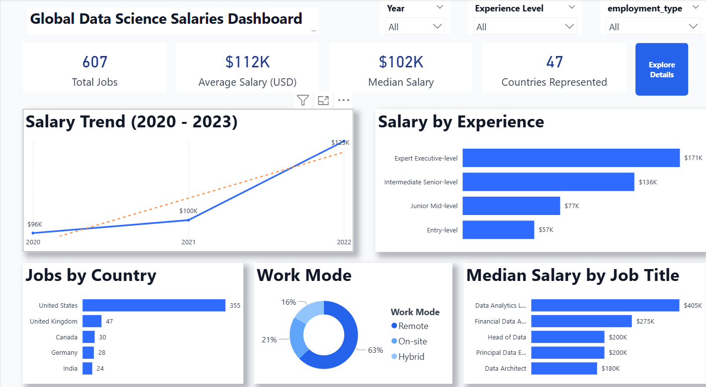

# Data Science Salary Analysis

This project analyzes global salary trends in the data science industry using Python and Power BI.

The goal of the project is to explore salary distribution, experience levels, job roles, and geographic trends in the global data science job market.

---

# Project Structure

data-science-salary-analysis

data → dataset  
notebooks → Python analysis  
dashboard → Power BI dashboard  
images → dashboard preview  

---

# Dashboard Preview

---

# Tools Used

Python  
Power BI  
Pandas  
Matplotlib  
Seaborn  
Data Visualization  

---

# Python Analysis

The dataset was first explored using Python to perform:

- Data cleaning
- Exploratory Data Analysis (EDA)
- Salary distribution analysis
- Experience-level salary comparison
- Geographic salary trends

Key visualizations were generated to understand patterns before building the final dashboard.

Notebook available here:

notebooks/salary_analysis.ipynb

---

# Power BI Dashboard

An interactive dashboard was created in Power BI to allow users to explore the data visually.

The dashboard includes:

- Salary trends over time
- Median salary by experience level
- Job distribution by country
- Salary distribution
- Salary vs experience analysis
- Work mode analysis (Remote, Hybrid, On-site)

---

# Dataset

The dataset contains information about data science salaries worldwide, including:

- Job title
- Experience level
- Salary in USD
- Company location
- Employment type
- Work mode
- Year

Total records analyzed:

607 job entries across 47 countries.

---

# Key Insights

### Salary increases strongly with experience

Entry-level professionals earn around **$57K**, while expert-level professionals earn approximately **$171K**, highlighting the strong impact of experience on compensation.

---

### Senior and executive roles command the highest salaries

Positions such as **Head of Data, Principal Data Scientist, and Data Architect** often exceed **$180K**, with some specialized roles reaching over **$400K**.

---

### The United States leads the data science job market

The majority of data science jobs in the dataset are located in the United States, showing a strong concentration of opportunities compared to other countries.

---

### Remote work dominates the industry

Around **63% of jobs** are fully remote, reflecting the global and flexible nature of data science roles.

---

# Future Improvements

Possible extensions for this project include:

- Adding more recent salary data
- Building predictive salary models using Python
- Creating a machine learning salary prediction model
- Expanding geographic analysis

---

# Author

Alexis Ulla

Data Analyst focused on data visualization, analytics, and business intelligence.
